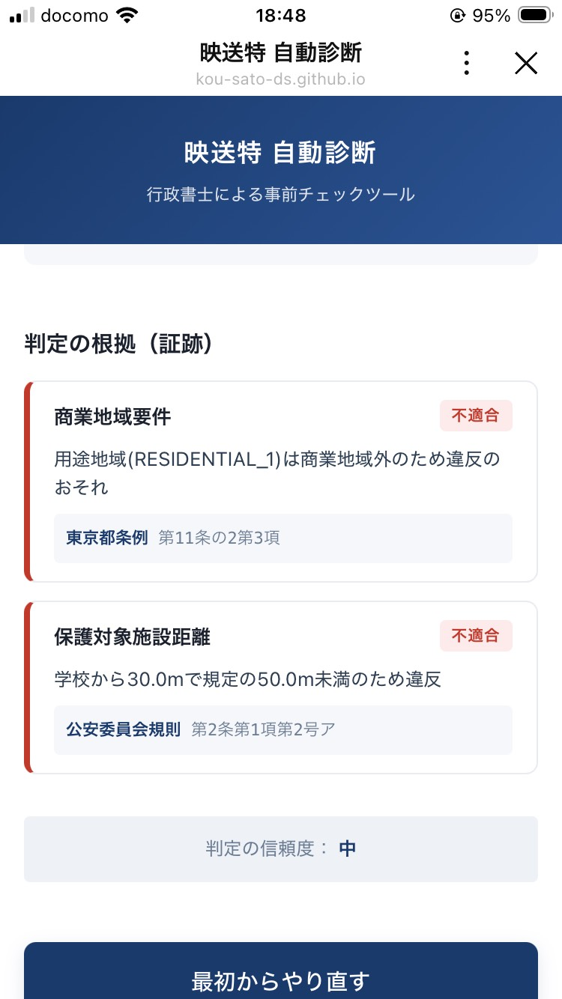
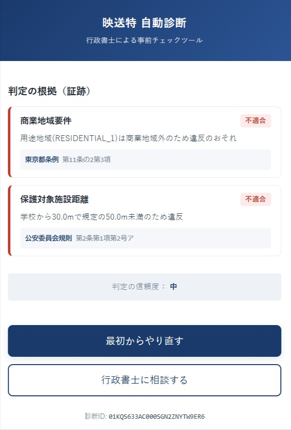
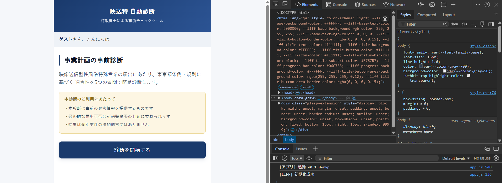
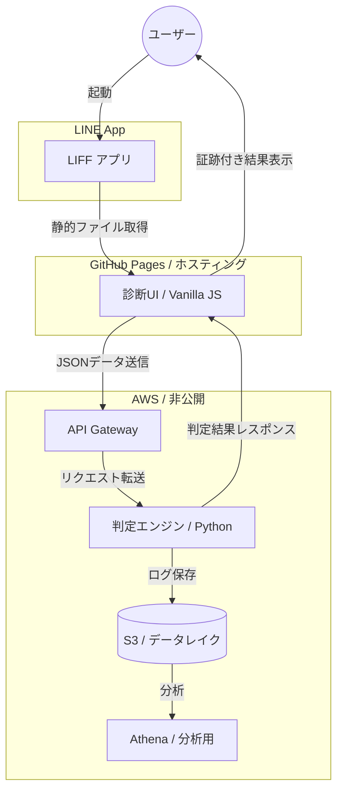

# 映送特 自動診断アプリ (eizo-shindan-app)
**行政書士の実務知識とデータエンジニアリングを融合させた、サーバーレス法務診断アプリ**

## 📋 プロジェクト概要
風営法等の複雑な法規制に基づき、事業計画の適合性をリアルタイムで判定するMVP（Minimum Viable Product）です。
※本リポジトリはフロントエンドおよび全体設計の公開用です。バックエンド（判定ロジック・インフラ構成）はセキュリティ保護のため非公開としています。

## 🖼 診断デモ
| トップ画面 | 診断結果（エビデンス表示） | 開発者ログ (v0.1.0-mvp) |
| :---: | :---: | :---: |
|  |  |  |

## ✨ エンジニアリングのこだわり
- **データエンジニアリング視点の拡張性**: 診断ログをS3へ蓄積し、Amazon Athenaでの分析を見据えたデータレイク構成をバックエンドに採用[cite: 2, 5]。
- **サーバーレス・低コスト運用**: AWS LambdaとAPI GatewayをIaC(SAM)で管理し、スケーラビリティと保守性を両立[cite: 2, 5]。
- **ドメイン知識の実装**: 判定結果と共に根拠条文を動的に表示し、専門家の判断プロセスをデジタル化[cite: 9]。
- **ULIDによるデータ一貫性**: 診断ごとにユニークなIDを発行し、フロントから分析基盤まで一貫した履歴追跡（トレーサビリティ）を担保。

## 🏗 システムアーキテクチャ

## 🛠 技術スタック
- **Frontend**: HTML5, CSS3, JavaScript (ES6+)
- **Platform**: LINE Front-end Framework (LIFF)
- **Infrastructure (Backend)**: AWS Lambda, API Gateway (IaC: AWS SAM)[cite: 2, 5]
- **Data Engineering**: CloudWatch Logs, Amazon S3, Amazon Athena (Planned)[cite: 2, 5]

---
© 2026 Sato Kou. All Rights Reserved.