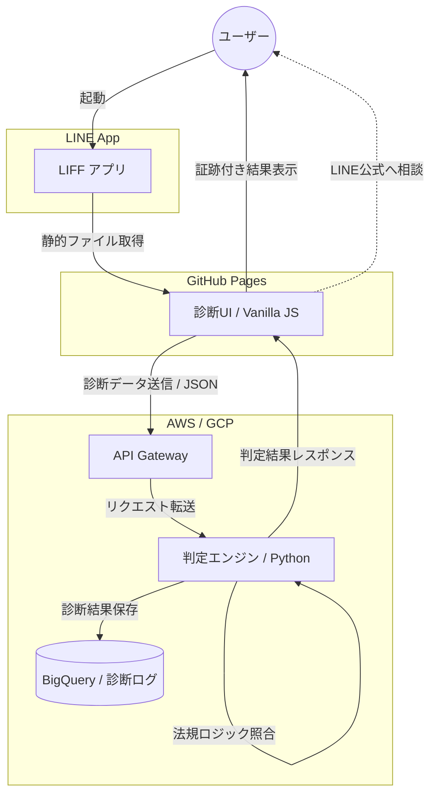

# 映送特 自動診断アプリ (eizo-shindan-app)
行政書士の実務知識とモダンな技術スタックを融合させた、サーバーレス法務診断LIFFアプリケーション。

## 📋 プロジェクト概要
風営法等の複雑な法規制（東京都条例・規則等）に基づき、事業計画の適合性をリアルタイムで判定します。専門知識のないユーザーでも、5つの質問に回答するだけで「行政書士による事前スクリーニング」と同等の示唆を得られることを目的としたMVP（Minimum Viable Product）です。

## 🖼 診断デモ
| トップ画面 | 診断結果（エビデンス表示） | 開発者ログ (v0.1.0-mvp) |
| :---: | :---: | :---: |
|  |  |  |
| 直感的なUI | 根拠条文を動的に表示 | 実機での動作・通信確認 |

## ✨ 特徴・機能
- **ドメイン知識を注入した判定エンジン**: 用途地域要件や保護対象施設距離など、実務上クリティカルな基準に基づいた適合判定。
- **エビデンス（証跡）の動的表示**: 判定結果と共に、具体的な条項（例：東京都条例 第11条の2第3項）を明示し、透明性を確保。
- **実務フローに即した設計**: 判定結果の信頼度スコアリング機能を搭載し、リスクが高い場合はシームレスに専門家相談へ誘導。
- **ULIDによるデータ管理**: 診断ごとにユニークなIDを発行。フロントエンドからバックエンドまで一貫した履歴追跡を担保。

## 🏗 システムアーキテクチャ
スケーラビリティと保守性を考慮し、AWS/GCPを活用した完全サーバーレス構成を採用しています。

## 🛠 技術スタック
- **Frontend**: HTML5, CSS3, JavaScript (Vanilla JS / ES6+)
- **Platform**: LINE Front-end Framework (LIFF)
- **Infrastructure**: GitHub Pages, AWS (Lambda, API Gateway)
- **Data Analysis**: BigQuery (Planned)
- **Tools**: Git / GitHub, VS Code, GitHub Actions (CI/CD)

---
© 2026 Sato Kou. All Rights Reserved.